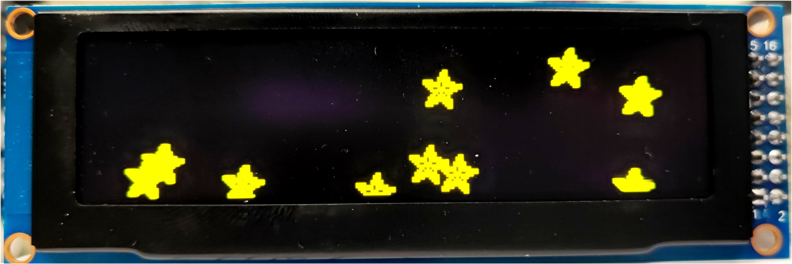

# About this library

This library is for 3.2 inch SSD1322 256x64 16-color gray scale OLEDs.

Display update rate on Teensy is really fast, i didn't notice any flickering.

It is based on the [Adafruit GFX Graphics Library](https://learn.adafruit.com/adafruit-gfx-graphics-library/overview), so read the documentation there.

The lib is loosely adopted from other Adafruit GFX based libraries and optimized to just contain as much code as necessary.
Feel free to use it.

Dont forget to call **SSD1322::update()** to put the actual contents from the display buffer to the OLED.

## 4-wire SPI (R19,R21 USE, R18,R20 DONT USE)

The OLED needs to be connected via 4-wire SPI (SCK,MOSI,CS,RST,D/C).
As the SSD1322 has different command interfaces, the display needs to be configured.

In my case, this is done by 4 resistors:
- R19, R21 soldered
- R18, R20 not soldered

**Be careful, the SSD1322 has max 3.5V I/O voltage.**

Do not connect to 5V based Arduinos, i'm using an Teensy 3.2 

| Pin   | Symbol | Level      | Function                    | Wire Color   |
| :---: | :---: | :---------: | :-------------------------- | :----------- |
|  1    | GND   | 0V          | Power Ground                | blue         |
|  2    | VDD   | +3.3V~+5.0V | Power Supply for Logic      | red          |
|  3    | NC    | (-)         | do no connect               |              |
|  4    | SCLK  | H/L         | SPI Clock                   | orange       | 
|  5    | SDIN  | H/L         | SPI MOSI (data from master) | yellow       |
|  6    | NC    | (-)         | do no connect               |              |
|  7~11 | D3~D7 | 0V          | Power Ground                | connect to 1 |
|  12   | RD    | 0V          | Power Ground                | connect to 1 |
|  13   | WR    | 0V          | Power Ground                | connect to 1 |
|  14   | D/C   | H/L         | H: data, L:command          | green        |
|  15   | /RST  | H/L         | L: reset                    | violet       |
|  16   | /CS   | H/L         | L: select SSD1322           | gray         |

have phun,

Winfried
